# Smart Farming System - Wiring Diagram

This document provides detailed wiring instructions for the ESP32 Smart Farming System.

> **📋 For comprehensive configuration options, pros/cons, and recommended setups, see [configuration.md](configuration.md)**

## Component Overview

### Required Components
- ESP32 Development Board
- Soil Moisture Sensor (Analog)
- Relay Module (5V)
- LEDs (Green, Red, Blue)
- Resistors (10kΩ, 220Ω)
- Breadboard and jumper wires
- Power supply (5V/3.3V)

### Optional Components
- **Temperature/Humidity Sensor Options**:
  - DHT11 Temperature/Humidity Sensor
  - DHT22 Temperature/Humidity Sensor (more accurate)
  - No temperature/humidity sensor (soil moisture only)
- **Light Sensor Options**:
  - LDR Sensor (Light Dependent Resistor)
  - No light sensor (soil moisture only)
- **Display Options**:
  - LCD 1602 with I2C Backpack (16x2 characters)
  - LCD 2004 with I2C Backpack (20x4 characters)
  - No display (headless mode)
- **Control Options**:
  - Rotary Encoder with Push Button
  - Potentiometer (10kΩ)
  - No control (fully automated)

## Pin Assignments

| Component | ESP32 Pin | Function | Notes |
|-----------|-----------|----------|-------|
| **Core Components** | | | |
| Soil Moisture | GPIO 36 | Analog Input | Connect to analog output of sensor |
| Relay Control | GPIO 19 | Digital Output | Connect to relay control pin |
| Green LED | GPIO 18 | Digital Output | System status indicator |
| Red LED | GPIO 23 | Digital Output | Pump active indicator |
| Blue LED | GPIO 2 | Digital Output | WiFi status (online version) |
| **Temperature/Humidity Sensor** (Optional) | | | |
| DHT Data | GPIO 5 | Digital Input | Connect to data pin of DHT sensor |
| **Light Sensor** (Optional) | | | |
| LDR Sensor | GPIO 39 | Analog Input | Connect to voltage divider output |
| **Display System** (Optional) | | | |
| LCD SDA | GPIO 21 | I2C Data | Connect to SDA on I2C backpack |
| LCD SCL | GPIO 22 | I2C Clock | Connect to SCL on I2C backpack |
| **Control System** (Optional) | | | |
| Rotary Encoder CLK | GPIO 16 | Digital Input | Clock pin (if encoder enabled) |
| Rotary Encoder DT | GPIO 17 | Digital Input | Data pin (if encoder enabled) |
| Rotary Encoder SW | GPIO 4 | Digital Input | Switch/Button pin (if encoder enabled) |
| Potentiometer | GPIO 34 | Analog Input | Center pin (if potentiometer enabled) |
| **Safety Features** (Optional) | | | |
| Emergency Stop | GPIO 0 | Digital Input | Emergency stop button (optional) |

## Detailed Wiring Instructions

### 1. ESP32 Power Connections
```
ESP32 VIN → 5V Power Supply (+)
ESP32 GND → Power Supply (-)
ESP32 3.3V → 3.3V for sensors
```

### 2. Display System (Optional)

#### LCD 1602/2004 with I2C Backpack
```
LCD VCC → 5V
LCD GND → GND
LCD SDA → GPIO 21
LCD SCL → GPIO 22
```

#### No Display (Headless Mode)
- Skip LCD connections
- System uses serial output only
- Web interface available (online version)

### 3. Temperature/Humidity Sensor (Optional)

#### DHT11/DHT22 Sensor
```
DHT VCC → 3.3V
DHT GND → GND
DHT Data → GPIO 5
DHT Data → 10kΩ Pull-up Resistor → 3.3V
```

#### No Temperature/Humidity Sensor
- Skip DHT connections
- System uses default temperature (25°C) and humidity (50%) values
- Only soil moisture monitoring available

### 4. Light Sensor (Optional)

#### LDR Sensor (Light Dependent Resistor)
```
LDR VCC → 3.3V
LDR GND → GND
LDR Signal → GPIO 39 (ADC1_CH3)
10kΩ Resistor → Between LDR Signal and GND (Pull-down)
```

#### No Light Sensor
- Skip LDR connections
- System uses default light level (50%) values
- Only soil moisture and temperature/humidity monitoring available

### 5. Soil Moisture Sensor
```
Sensor VCC → 3.3V
Sensor GND → GND
Sensor A0 → GPIO 36 (ADC1_CH0)
```

### 6. Relay Module
```
Relay VCC → 5V
Relay GND → GND
Relay IN → GPIO 19
Relay NO → Water Pump (+)
Relay COM → Power Supply (+)
```

### 7. Control System (Optional)

#### Rotary Encoder
```
Encoder VCC → 3.3V
Encoder GND → GND
Encoder CLK → GPIO 16
Encoder DT → GPIO 17
Encoder SW → GPIO 4
```

#### Potentiometer
```
Potentiometer Pin 1 → 3.3V
Potentiometer Pin 2 → GPIO 34 (Center pin)
Potentiometer Pin 3 → GND
```

#### No Control (Fully Automated)
- Skip control connections
- System uses default thresholds
- Fully automated operation

### 8. Status LEDs
```
Green LED (+) → GPIO 18
Green LED (-) → 220Ω Resistor → GND

Red LED (+) → GPIO 23
Red LED (-) → 220Ω Resistor → GND

Blue LED (+) → GPIO 2
Blue LED (-) → 220Ω Resistor → GND
```

### 9. Emergency Stop (Optional)
```
Emergency Button Pin 1 → GPIO 0
Emergency Button Pin 2 → GND
```

## Circuit Diagram

```mermaid
graph TB
    subgraph "ESP32 Development Board"
        ESP32[ESP32<br/>Microcontroller]
        
        subgraph "Power Pins"
            VIN[VIN - 5V]
            V33[3.3V]
            GND[GND]
        end
        
        subgraph "GPIO Pins"
            GPIO5[GPIO 5<br/>DHT Data]
            GPIO18[GPIO 18<br/>Green LED]
            GPIO19[GPIO 19<br/>Relay Control]
            GPIO21[GPIO 21<br/>LCD SDA]
            GPIO22[GPIO 22<br/>LCD SCL]
            GPIO23[GPIO 23<br/>Red LED]
            GPIO2[GPIO 2<br/>Blue LED]
            GPIO16[GPIO 16<br/>Encoder CLK]
            GPIO17[GPIO 17<br/>Encoder DT]
            GPIO4[GPIO 4<br/>Encoder SW]
            GPIO34[GPIO 34<br/>Potentiometer]
            GPIO36[GPIO 36<br/>Soil Moisture]
            GPIO39[GPIO 39<br/>LDR Sensor]
            GPIO0[GPIO 0<br/>Emergency Stop]
        end
    end
    
    subgraph "Core Components"
        SOIL[Soil Moisture<br/>Sensor<br/>REQUIRED]
        RELAY[Relay Module<br/>5V<br/>REQUIRED]
        LEDG[Green LED<br/>Status<br/>REQUIRED]
        LEDR[Red LED<br/>Pump Active<br/>REQUIRED]
        LEDB[Blue LED<br/>WiFi Status<br/>REQUIRED]
    end
    
    subgraph "Optional Sensors"
        DHT11[DHT11 Sensor<br/>Temperature/Humidity<br/>OPTIONAL]
        DHT22[DHT22 Sensor<br/>Temperature/Humidity<br/>OPTIONAL]
        LDR[LDR Sensor<br/>Light Detection<br/>OPTIONAL]
    end
    
    subgraph "Optional Display"
        LCD1602[LCD 1602<br/>16x2 Characters<br/>OPTIONAL]
        LCD2004[LCD 2004<br/>20x4 Characters<br/>OPTIONAL]
    end
    
    subgraph "Optional Control"
        ENCODER[Rotary Encoder<br/>Menu Control<br/>OPTIONAL]
        POT[Potentiometer<br/>10kΩ<br/>OPTIONAL]
    end
    
    subgraph "Optional Safety"
        EMERGENCY[Emergency Stop<br/>Button<br/>OPTIONAL]
    end
    
    subgraph "Power Supply"
        PSU[5V/3.3V<br/>Power Supply<br/>2A Minimum]
    end
    
    %% Core Connections
    SOIL --> GPIO36
    RELAY --> GPIO19
    LEDG --> GPIO18
    LEDR --> GPIO23
    LEDB --> GPIO2
    
    %% Optional Sensor Connections
    DHT11 -.-> GPIO5
    DHT22 -.-> GPIO5
    LDR -.-> GPIO39
    
    %% Optional Display Connections
    LCD1602 -.-> GPIO21
    LCD1602 -.-> GPIO22
    LCD2004 -.-> GPIO21
    LCD2004 -.-> GPIO22
    
    %% Optional Control Connections
    ENCODER -.-> GPIO16
    ENCODER -.-> GPIO17
    ENCODER -.-> GPIO4
    POT -.-> GPIO34
    
    %% Optional Safety Connections
    EMERGENCY -.-> GPIO0
    
    %% Power Connections
    PSU --> VIN
    PSU --> V33
    PSU --> GND
    
    %% Styling
    classDef required fill:#ffcccc,stroke:#ff0000,stroke-width:2px
    classDef optional fill:#ccffcc,stroke:#00ff00,stroke-width:2px
    classDef esp32 fill:#ccccff,stroke:#0000ff,stroke-width:3px
    classDef power fill:#ffffcc,stroke:#ffaa00,stroke-width:2px
    
    class SOIL,RELAY,LEDG,LEDR,LEDB required
    class DHT11,DHT22,LCD1602,LCD2004,ENCODER,POT,EMERGENCY optional
    class ESP32,VIN,V33,GND,GPIO5,GPIO18,GPIO19,GPIO21,GPIO22,GPIO23,GPIO2,GPIO16,GPIO17,GPIO4,GPIO34,GPIO36,GPIO0 esp32
    class PSU power
```



### Legend
- **Solid Lines**: Required connections
- **Dashed Lines**: Optional connections
- **Red**: Required components
- **Green**: Optional components
- **Blue**: ESP32 and GPIO pins
- **Yellow**: Power supply

## Configuration Examples

### Minimal Setup (Soil Moisture Only)
- **Sensors**: Soil moisture sensor only
- **Display**: None (headless mode)
- **Control**: None (fully automated)
- **Wiring**: Core components only
- **Best for**: Basic soil monitoring, cost-effective setup

### Basic Setup (DHT11 + LCD 1602)
- **Sensors**: Soil moisture + DHT11 temperature/humidity
- **Display**: LCD 1602 with I2C backpack
- **Control**: None (fully automated)
- **Wiring**: Core components + DHT + LCD
- **Best for**: Simple home gardens, basic monitoring

### Professional Setup (DHT22 + LCD 2004 + Rotary Encoder)
- **Sensors**: Soil moisture + DHT22 temperature/humidity
- **Display**: LCD 2004 with I2C backpack
- **Control**: Rotary encoder with push button
- **Wiring**: All components including encoder
- **Best for**: Professional installations, full-featured operation

### Remote IoT Setup (DHT22 + No Display + No Control)
- **Sensors**: Soil moisture + DHT22 temperature/humidity
- **Display**: None (headless mode)
- **Control**: None (fully automated)
- **Wiring**: Core components + DHT only
- **Best for**: Remote installations, IoT deployments, web monitoring

### Simple Control Setup (DHT11 + LCD 1602 + Potentiometer)
- **Sensors**: Soil moisture + DHT11 temperature/humidity
- **Display**: LCD 1602 with I2C backpack
- **Control**: Potentiometer for threshold adjustment
- **Wiring**: Core components + DHT + LCD + potentiometer
- **Best for**: Basic installations with manual control

### Soil-Only Professional (No DHT + LCD 2004 + Rotary Encoder)
- **Sensors**: Soil moisture sensor only
- **Display**: LCD 2004 with I2C backpack
- **Control**: Rotary encoder with push button
- **Wiring**: Core components + LCD + encoder (no DHT)
- **Best for**: Soil-focused monitoring, greenhouse applications

## Power Supply Requirements

### Recommended Power Supply
- **Voltage**: 5V DC (for ESP32 VIN pin)
- **Current**: Minimum 2A (to handle pump and all components)
- **Type**: Switching power supply or wall adapter

### Power Distribution
- ESP32 VIN: 5V
- ESP32 3.3V: 3.3V (for sensors and control components)
- Relay Module: 5V
- LCD Display: 5V
- LEDs: 3.3V (with current limiting resistors)
- Rotary Encoder: 3.3V
- Potentiometer: 3.3V

## Safety Considerations

### Electrical Safety
1. **Power Supply**: Use proper power supply with adequate current rating
2. **Grounding**: Ensure proper grounding of all components
3. **Insulation**: Use proper insulation for high-voltage connections
4. **Fuses**: Consider adding fuses for protection

### Water Safety
1. **Waterproofing**: Protect electronics from water exposure
2. **Enclosure**: Use waterproof enclosure for outdoor installation
3. **Cable Management**: Use waterproof cable glands for external connections

## Troubleshooting Wiring Issues

### Common Problems

1. **LCD Not Displaying**
   - Check I2C connections (SDA/SCL)
   - Verify I2C address (0x27 or 0x3F)
   - Check power supply (5V)
   - Verify DISPLAY_TYPE setting in config.h

2. **Sensors Not Reading**
   - **Soil Moisture**: Verify GPIO 36 connection, check power supply (3.3V)
   - **DHT Sensor**: Check GPIO 5 connection, verify pull-up resistor (10kΩ)
   - **LDR Sensor**: Verify GPIO 39 connection, check 10kΩ pull-down resistor
   - **Power Supply**: Ensure 3.3V for all sensors
   - **Grounding**: Ensure proper grounding for all sensors
   - **Configuration**: Check DHT_SENSOR_TYPE and LDR_SENSOR_TYPE settings in config.h

3. **Relay Not Working**
   - Check relay control pin connection
   - Verify relay power supply (5V)
   - Test relay with multimeter
   - Check pump runtime protection settings

4. **LEDs Not Working**
   - Check LED polarity
   - Verify current limiting resistors
   - Check GPIO pin connections

5. **Control System Issues**
   - **Rotary Encoder**: Check CLK, DT, and SW pin connections
   - **Potentiometer**: Verify center pin connection to GPIO 34
   - **Menu Not Working**: Check CONTROL_TYPE setting in config.h
   - **No Response**: Verify pull-up resistors and power supply

6. **Display Issues**
   - **No Display**: Check DISPLAY_TYPE setting (NONE vs LCD)
   - **Wrong Display**: Verify LCD_COLS and LCD_ROWS settings
   - **Cycling Issues**: Check DISPLAY_SCREEN_COUNT setting

7. **DHT Sensor Issues**
   - **No Temperature/Humidity**: Check DHT_SENSOR_TYPE setting (DHT_NONE vs DHT11/DHT22)
   - **Wrong Sensor Type**: Verify DHT_SENSOR_TYPE matches your hardware
   - **Reading Errors**: Check GPIO 5 connection and pull-up resistor
   - **Default Values**: System uses 25°C/50% humidity when DHT disabled

### Testing Procedures

1. **Power Test**: Verify all power connections with multimeter
2. **Continuity Test**: Check all signal connections
3. **Sensor Test**: Test each sensor individually
4. **Actuator Test**: Test relay and LEDs separately
5. **Display Test**: Verify LCD initialization and display content
6. **Control Test**: Test rotary encoder or potentiometer functionality
7. **Configuration Test**: Verify all settings in config.h match hardware

### Configuration Verification

Before testing, ensure your `config.h` settings match your hardware:

#### Sensor Configuration
```cpp
// Verify these match your hardware:
#define DHT_SENSOR_TYPE DHT22           // or DHT11, DHT_NONE
#define SOIL_MOISTURE_PIN 36            // Soil moisture sensor pin
```

#### Display Configuration
```cpp
// Verify these match your hardware:
#define DISPLAY_TYPE DISPLAY_LCD_1602    // or DISPLAY_LCD_2004, DISPLAY_NONE
#define LCD_COLS 16                      // 16 for 1602, 20 for 2004
#define LCD_ROWS 2                       // 2 for 1602, 4 for 2004
```

#### Control Configuration
```cpp
// Verify these match your hardware:
#define CONTROL_TYPE CONTROL_ROTARY_ENCODER  // or CONTROL_POTENTIOMETER, CONTROL_NONE
#define ENCODER_CLK_PIN 16               // Rotary encoder clock pin
#define ENCODER_DT_PIN 17                // Rotary encoder data pin
#define ENCODER_SW_PIN 4                 // Rotary encoder switch pin
#define POTENTIOMETER_PIN 34             // Potentiometer center pin
```

#### Pin Verification
- **Core Pins**: GPIO 36 (Soil), GPIO 19 (Relay)
- **Sensor Pins**: GPIO 5 (DHT) - if DHT enabled, GPIO 39 (LDR) - if LDR enabled
- **LED Pins**: GPIO 18 (Green), GPIO 23 (Red), GPIO 2 (Blue)
- **Display Pins**: GPIO 21 (SDA), GPIO 22 (SCL) - if display enabled
- **Control Pins**: GPIO 16,17,4 (Encoder) or GPIO 34 (Potentiometer) - if control enabled
- **Safety Pins**: GPIO 0 (Emergency Stop) - if enabled

## Enclosure and Mounting

### Recommended Enclosure
- **Material**: Waterproof plastic or metal
- **Size**: Minimum 200x150x100mm
- **Features**: Cable glands, ventilation, mounting holes

### Mounting Considerations
- **Location**: Protected from direct sunlight and rain
- **Accessibility**: Easy access for maintenance
- **Ventilation**: Adequate airflow for cooling
- **Cable Management**: Proper cable routing and protection

## Maintenance and Upgrades

### Regular Maintenance
- Check all connections monthly
- Clean sensors and LCD display
- Verify power supply operation
- Test all functions

### Potential Upgrades
- **Sensor Expansion**: Add more sensors (pH, light, CO2, etc.)
- **Power Options**: Implement solar power, add backup power supply
- **Enclosure**: Enhance waterproofing, add ventilation
- **Control**: Upgrade from potentiometer to rotary encoder
- **Display**: Upgrade from LCD 1602 to LCD 2004
- **Connectivity**: Add cellular modem, LoRa, or other wireless options
- **Automation**: Add scheduling, weather integration, mobile app

## Additional Resources

### Tools Required
- Multimeter
- Wire strippers
- Soldering iron (if needed)
- Breadboard or PCB
- Cable ties and mounting hardware

### Documentation
- ESP32 Pinout Reference
- Component datasheets
- Safety guidelines
- Local electrical codes
